## Writeup

---

**Advanced Lane Finding Project**

The goals / steps of this project are the following:

* Compute the camera calibration matrix and distortion coefficients given a set of chessboard images.
* Apply a distortion correction to raw images.
* Use color transforms, gradients, etc., to create a thresholded binary image.
* Apply a perspective transform to rectify binary image ("birds-eye view").
* Detect lane pixels and fit to find the lane boundary.
* Determine the curvature of the lane and vehicle position with respect to center.
* Warp the detected lane boundaries back onto the original image.
* Output visual display of the lane boundaries and numerical estimation of lane curvature and vehicle position.

[//]: # "Image References"

## [Rubric](https://review.udacity.com/#!/rubrics/571/view) Points

### Here I will consider the rubric points individually and describe how I addressed each point in my implementation.  

---

### Writeup / README

#### 1. This is the Writeup that includes all the rubric points and how you addressed each one.  
### Camera Calibration

#### 1. This is how I computed the camera matrix and distortion coefficients. 

The code for this step is contained in the first code cell of the `camera_calibration.py`. 

I start by preparing "object points", which will be the (x, y, z) coordinates of the chessboard corners in the world. Here I am assuming the chessboard is fixed on the (x, y) plane at z=0, such that the object points are the same for each calibration image.  Thus, `objp` is just a replicated array of coordinates, and `objpoints` will be appended with a copy of it every time I successfully detect all chessboard corners in a test image.  `imgpoints` will be appended with the (x, y) pixel position of each of the corners in the image plane with each successful chessboard detection.  

I saved the output `objpoints` and `imgpoints` for computing the camera calibration and distortion coefficients using the `cv2.calibrateCamera()` function. 

### Pipeline (single images)

#### 1. Provide an example of a distortion-corrected image.

The following opencv method is used in `LanePipeline.py` for undistortion. 

```python
undist = cv2.undistort(img, self.mtx, self.dist, None, self.mtx)
```
|  | 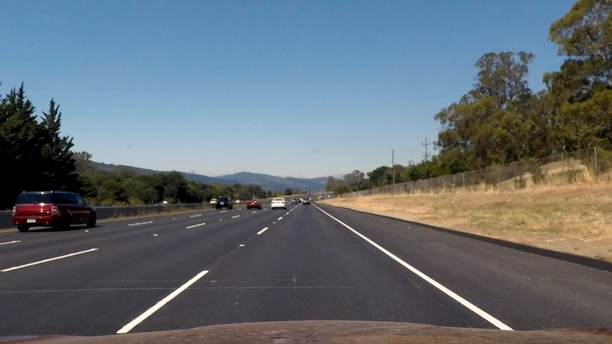 |
| :----------------------------------------------------------: | :----------------------------------------------------------: |
|                           Original                           |                         Undistorted                          |

#### 2. Describe how (and identify where in your code) you used color transforms, gradients or other methods to create a thresholded binary image.  Provide an example of a binary image result.

I used the saturation channel of the colorful image, as the white and yellow lanes standout in the saturation channel, even in case of shadowing. 

```python
image = cv2.cvtColor(image_undistort,cv2.COLOR_RGB2HLS)[:,:,2]
```

The demostrated below are HLS channels of an image with tree shadow illusion. The comparision favors the saturation channel which distinguish the lane lines well from the background. 

| 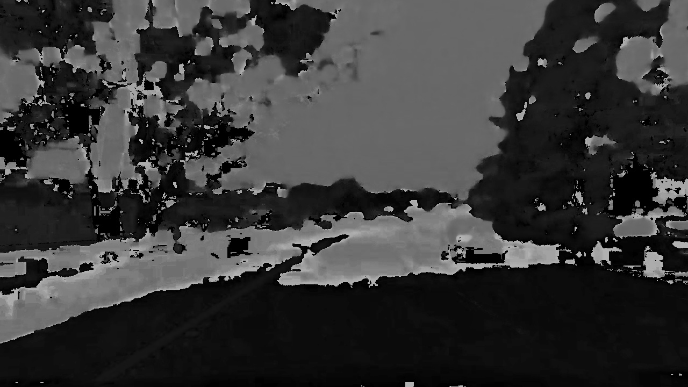 | 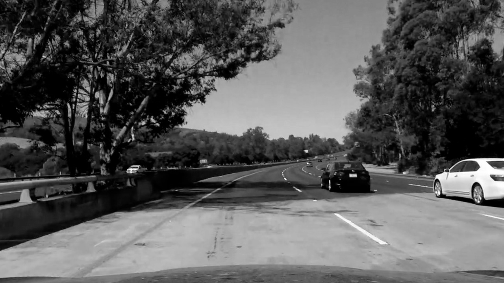 | 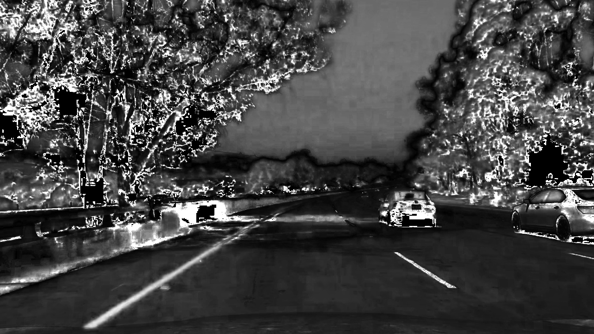 |
| :----------------------------------------------------------: | :----------------------------------------------------------: | :----------------------------------------------------------: |
|                             Hue                              |                          Lightness                           |                          Saturation                          |

The edges of the lanes are sharp. Sobel method is a good choice to find the lanes from the backgroud. In the code, the `cv2.Sobel` function is used to calculate the absolute gradient. The image is converted to a binary two-dimensional ararry. 

```python
    def abs_sobel_thresh(self,img, sobel_kernel=5, mag_thresh=(50, 255)):
        # Take both Sobel x and y gradients
        sobelx = cv2.Sobel(img, cv2.CV_64F, 1, 0, ksize=sobel_kernel)
        sobely = cv2.Sobel(img, cv2.CV_64F, 0, 1, ksize=sobel_kernel)
        # Calculate the gradient magnitude
        gradmag = np.sqrt(sobelx**2 + sobely**2)
        # Rescale to 8 bit
        scale_factor = np.max(gradmag)/255 
        gradmag = (gradmag/scale_factor).astype(np.uint8) 
        # Create a binary image of ones where threshold is met, zeros otherwise
        binary_output = np.zeros_like(gradmag)
        binary_output[(gradmag >= mag_thresh[0]) & (gradmag <= mag_thresh[1])] = 1
        # Return the binary image
        return binary_output
```
A small kernel size and a high lower threshold is a good choice to highlight the lanes. 

The following shows the comparison of lane marker detection using the lightness and using the spatial gradient of the lightness. The comparison shows that the edge helps to remove the large portions of high-saturaton parts like the sky from the image. 

| 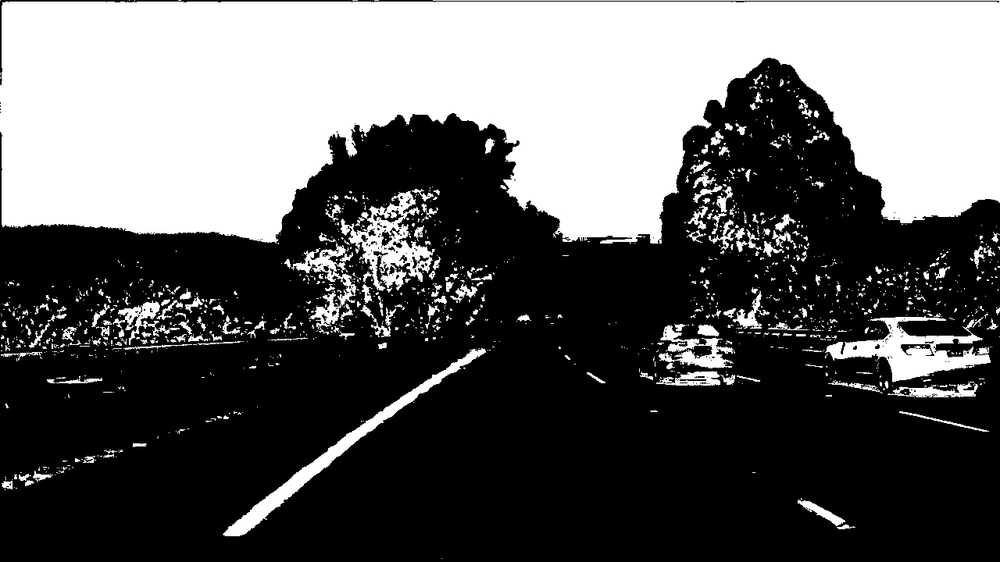 | 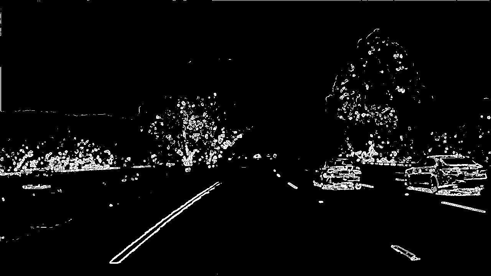 |
| ------------------------------------------------------------ | ------------------------------------------------------------ |
| threshold = 100, saturation channnel                         | kernel = 5, threshold = 50, gradient of saturation           |


#### 3. Describe how (and identify where in your code) you performed a perspective transform and provide an example of a transformed image.

The `getPerspectiveTransform` and `warpPerspective` methods in `cv2` are used to transform the road from a distorted perspective to the bird-eye perspective. 

```python
self.perspectiveTransform = cv2.getPerspectiveTransform(src, dst)
warped = cv2.warpPerspective(img, self.perspectiveTransform, self.img_size)
```

The warp of perspective results in two approximately parallel lines. 

| 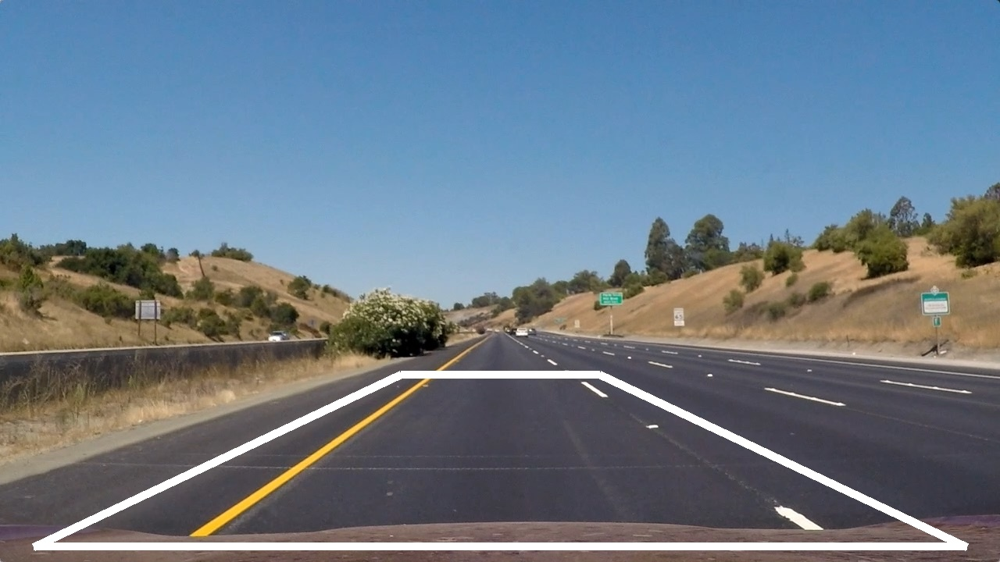 | 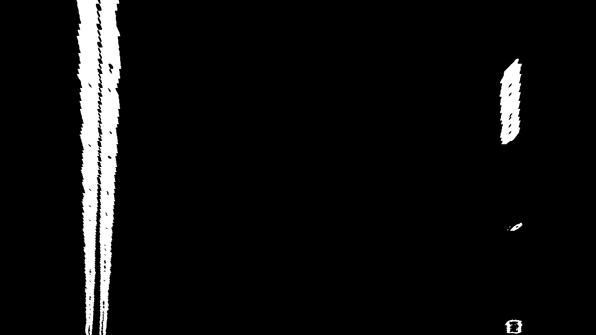 |
| ------------------------------------------------------------ | ------------------------------------------------------------ |
|                                                              |                                                              |

The left and right lane has been very distinct in the binary image. By inviding the image into the left half and the right half, the curves of the left lane and right lane can be detected respectively. 

#### 4. Describe how (and identify where in your code) you identified lane-line pixels and fit their positions with a polynomial?

Instead of using the proposed method to segment the images horizontally, and using the center points, I randomly sampled 100 points as the source of polyfitting. This method helped to overcome the issue when the lanes are not continuous. The light region on the following image is the detected lane. 

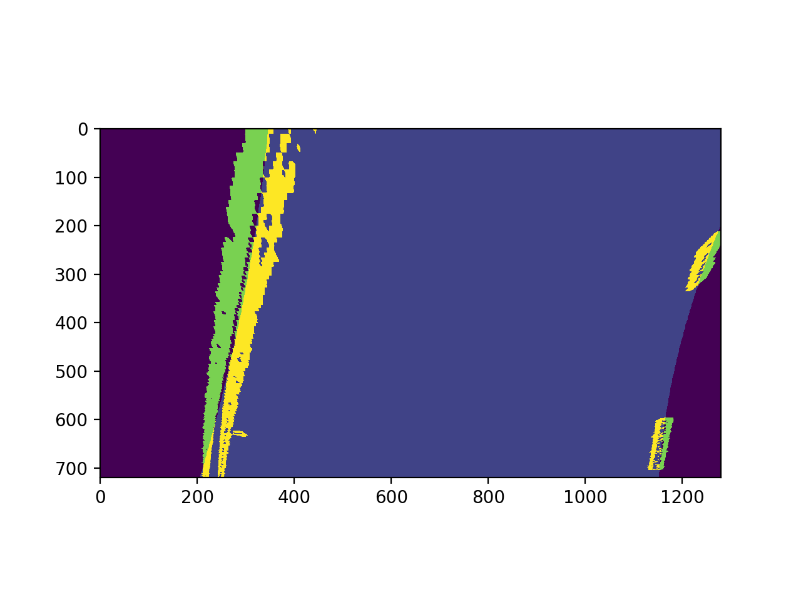


#### 5. Describe how (and identify where in your code) you calculated the radius of curvature of the lane and the position of the vehicle with respect to center.

I did this in lines # through # in my code in `my_other_file.py`

#### 6. Provide an example image of your result plotted back down onto the road such that the lane area is identified clearly.

The final step is to unwarp the detected lane region to the camera view. The unwarp can simply be down by reversing the source and destination points predefined. 

```python
self.perspectiveTransform_inverse = cv2.getPerspectiveTransform(dst, src)
unwarped = cv2.warpPerspective(img, self.perspectiveTransform_inverse, self.img_size)
```
Put the detected lane on the undistorted image, you see how accurate the lane detection is. 

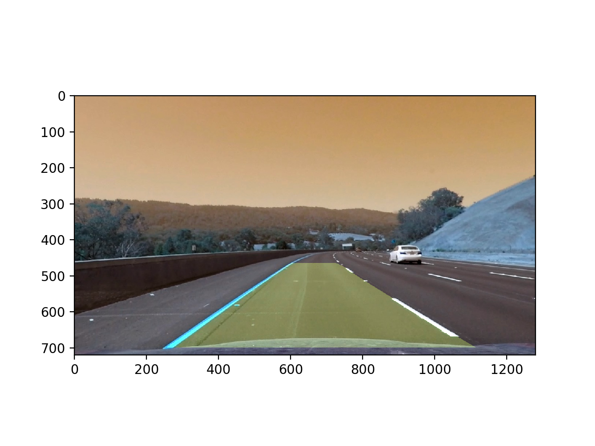

#### 7 curvature
Radius of the road at the position of the vehicle is calculated according to the fitted second-order polynomial function. The following scale factors are chosen

```python
        ym_per_pix = 60./720 # meters per pixel in y dimension
        xm_per_pix = 3.7/900 # meters per pixel in x dimension
```
which yields the radius of the left and right lane borders as follows

```
left_curverad: 5155.620527335683 m
right_curverad: 2463.7397387419674 m
car position: -0.22303237422553346 m
```

The two values are not the same due to fitting errors. But they satisfy the [curve regulation](http://onlinemanuals.txdot.gov/txdotmanuals/rdw/horizontal_alignment.htm#BGBHGEGC)

---

### Pipeline (video)

#### 1. Provide a link to your final video output.  Your pipeline should perform reasonably well on the entire project video (wobbly lines are ok but no catastrophic failures that would cause the car to drive off the road!).

Here's a [link to my video result](./output/project_video.mp4)

---

### Discussion

#### 1. Briefly discuss any problems / issues you faced in your implementation of this project.  Where will your pipeline likely fail?  What could you do to make it more robust?

Difficulties posed on the detection on a single image

* Broken lane marking
* Bluring by shadowing
* Sharp curve

But in lane detection in videos, history information can be used to augment data set. The lane doesn't move too much among successive video frames, though the dashed lane markings move backward fast. Therefore, it is good to use data from multiple video frames. 

The `LanePipeline` class in `LanePipeline.py` has queue type attributes to "remember" the sampled lane points up to certain number of frames. Then, the lane marking sample points form a continous curve. There is no drastic change of lane detecting due to false info. 

The image visualized the second problem. At the upper right image, the purple region is the warpped image. The white dots are the sampled lane marker data, including the data collected from a few previous frames, like the previous ten frames. If the current frame is too blurry, this frame will be discarded. We continue using previous information. The transparent green band is the detected lane. The image shows that the lane detection is not affected by the wrong frame by too much. 

| 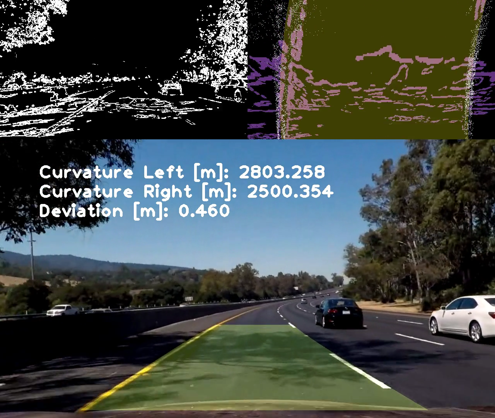 |
| ------------------------------------------------------------ |
| Discarded frame where lane markers are blurry|

The wrong edges of tree shadow has scatterred the sample points. The fitted polynomial curves won't tell the real lane marking from the shadow. It will be wise to dispose this frame at this moment. The quality of the fitting is measured by the mean square error. This philosophy is implemented in the following snipped of codes in `LanePipeline.py`. 

```python
    if(((left_J_val-left_J)**2).mean()>10000):
        # Evaluate the smaples of this frame. Discard largely scattered samples
        self.left_I_deque.pop()
        self.left_J_deque.pop()        
```

The sharp curve is the major issue in `harder_challenge_video.mp4`, which is not solved in this project yet. High level solutions above computer vision is wanted in dealing with the complexity. 

